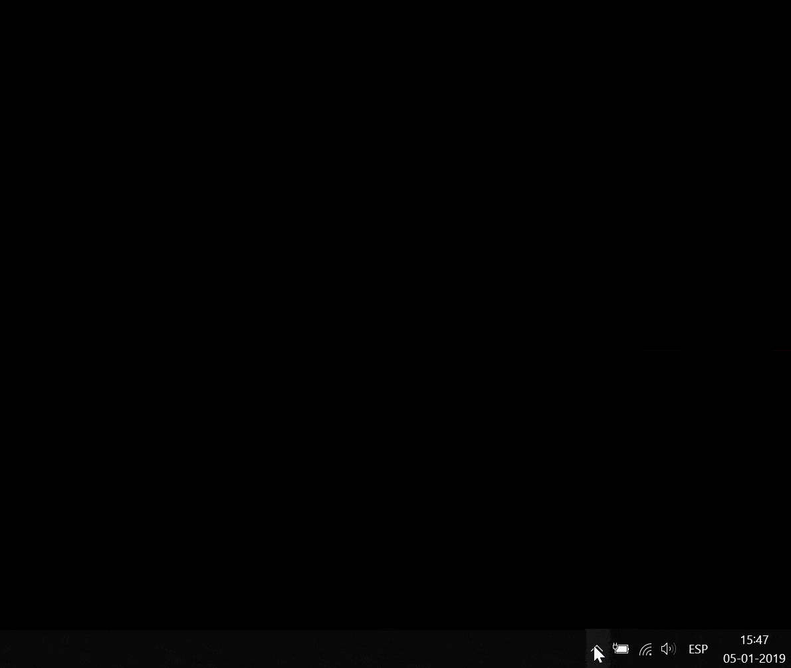

  
Añade controles de volumen y música a los teclados que no tengan botones dedicados para estas prestaciones.

#### Traducciones
* [English](README.md)

## Prestaciones
Esta aplicación añade las prestaciones siguentes por crear teclas aceleradoras
(pulsar una combinación de las teclas al mismo tiempo) para los teclados sin
botones dedicados para multimedia.
* subir el volumen &nbsp;&nbsp;&nbsp;&nbsp;&nbsp;&nbsp;&nbsp;&nbsp;&nbsp;&nbsp;&nbsp;&nbsp;&nbsp;&nbsp;&nbsp;&nbsp;&nbsp;&nbsp;&nbsp;&nbsp;&nbsp;&nbsp;&nbsp;&nbsp;&nbsp;&nbsp;&nbsp;&nbsp;&nbsp; (Ctrl + Mayús + flecha arriba)
* bajar el volumen &nbsp;&nbsp;&nbsp;&nbsp;&nbsp;&nbsp;&nbsp;&nbsp;&nbsp;&nbsp;&nbsp;&nbsp;&nbsp;&nbsp;&nbsp;&nbsp;&nbsp;&nbsp;&nbsp;&nbsp;&nbsp;&nbsp;&nbsp;&nbsp;&nbsp;&nbsp;&nbsp;&nbsp;&nbsp;&nbsp;(Ctrl + Mayús + flecha abajo)
* activar/desactivar el silenciamiento &nbsp;(Alt + flecha abajo)
* tocar la próxmia canción &nbsp;&nbsp;&nbsp;&nbsp;&nbsp;&nbsp;&nbsp;&nbsp;&nbsp;&nbsp;&nbsp;&nbsp;&nbsp;&nbsp;&nbsp;&nbsp;&nbsp;&nbsp;(Ctrl + Alt + flecha derecha)
* tocar la canción anterior &nbsp;&nbsp;&nbsp;&nbsp;&nbsp;&nbsp;&nbsp;&nbsp;&nbsp;&nbsp;&nbsp;&nbsp;&nbsp;&nbsp;&nbsp;&nbsp;&nbsp;&nbsp;(Ctrl + Alt + flecha izquierda)
* tocar/para la música &nbsp;&nbsp;&nbsp;&nbsp;&nbsp;&nbsp;&nbsp;&nbsp;&nbsp;&nbsp;&nbsp;&nbsp;&nbsp;&nbsp;&nbsp;&nbsp;&nbsp;&nbsp;&nbsp;&nbsp;&nbsp;&nbsp;&nbsp;&nbsp;(Ctrl + Alt + Print Screen)

## Descargar y configurar
<!---
Add link to YouTube video of me showing how to download and setup this program
-->
[Haz clic aquí para descargar *Controles multimedia para todos* para Windows](https://github.com/fernowj1/media-controls-for-all/releases/download/v1.0.0/Media.Controls.exe).
Verás un mensaje de advertencia cuando lo ejecutas porque no he comprado un
certificado. No signífica que la aplicación no es segura, solo signífica que
no soy editor conocido. La aplicación es gratuita, sin anuncios y no les pido
para donaciones. Así que gastar dinero para un certificado no tiene sentido
para mí. Si eres un desarollador, puedes compilar la aplicación por sí mismo
(puedes ver "Desarollo" debajo) y no verás la advertencia.

Cuando ejecuta la primera vez esta aplicación, te pide si quieres comenzarla
automáticamente después de iniciar sesión. Para cambiar luego tu decisión, ve al
menú de notificaciones y haz clic con el botón derecho al logotipo *Controles
multimedia para todos* y haz clic "Configurar el comienzo automático".

Si te olvidas las teclas aceleradoras, pues ver el menú de "Ayuda" para verlas.

Para desinstalar, ve al mismo menú y haz clic "Desinstalar".

## Desarollo
Si quieres modificar este proyecto, necesitarás [instalar la aplicación
AutoHotkey](https://www.autohotkey.com/). Después, puedes modificar main.ahk y
ejecutarlo para probarlo. Cuando estás contento con las modificaciones, ejecuta
Ahk2Exe (viene con la instalación de AutoHotkey) y añade el guión modificado y
un archivo de .ico para el icono.

Esta aplicación solo existe para Windows ahora porque depende de AutoHotkey, una
aplicación que ejecuta solo para Windows. Afortunadamente, casi todos las
computadoras de Apple vienen con teclados con botones multimedia. Si usas Linux,
algunas distribuciones Linux se permiten crear su propia teclas aceleradoras sin
escribir guión en la configuración. Depende, obviamente, la distribución.

<!---
Add link to YouTube video of me showing how to do it on Ubuntu.
-->

### Creador
John Fernow
<!---
Add link to website, GitLab, GitHub, Twitter, Instagram, and YouTube channel.
-->

### Los derechos del autor y permiso
El codigo está liberado por la [licencia MIT](LICENCIA).
